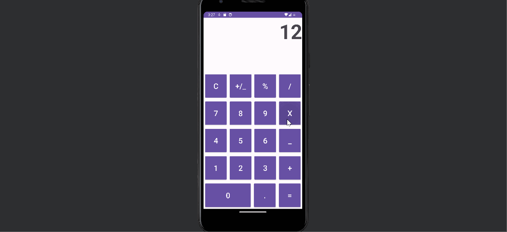

# Project 2 - Calculator App

App works simmilarly to IPhone calculator, now with more functionallity

## Functionality 

The following **required** functionality is completed:

* [X] Project 1 Requirements
* [X] App Logging
* [X] Calculator Icon
* [X] Maintains Data Across Rotations
* [X] Has Horizontal Layout
* [X] All Horizontal Buttons Function As Expected

## Video Walkthrough

Here's a walkthrough of implemented functionallity:

Notice: All trig functions are in Radians

GIF created with [LiceCap](http://www.cockos.com/licecap/).

## Notes

Looking at the slides I couldn't find mention on changing the icon so I had to do research based on memory. Furthermore, the lifecycle is confusing at times because of the sides not all showing all the information, one website of documentation would be really helpful.

## License

    Copyright [2023] [Michael Utz]

    Licensed under the Apache License, Version 2.0 (the "License");
    you may not use this file except in compliance with the License.
    You may obtain a copy of the License at

        http://www.apache.org/licenses/LICENSE-2.0

    Unless required by applicable law or agreed to in writing, software
    distributed under the License is distributed on an "AS IS" BASIS,
    WITHOUT WARRANTIES OR CONDITIONS OF ANY KIND, either express or implied.
    See the License for the specific language governing permissions and
    limitations under the License.
